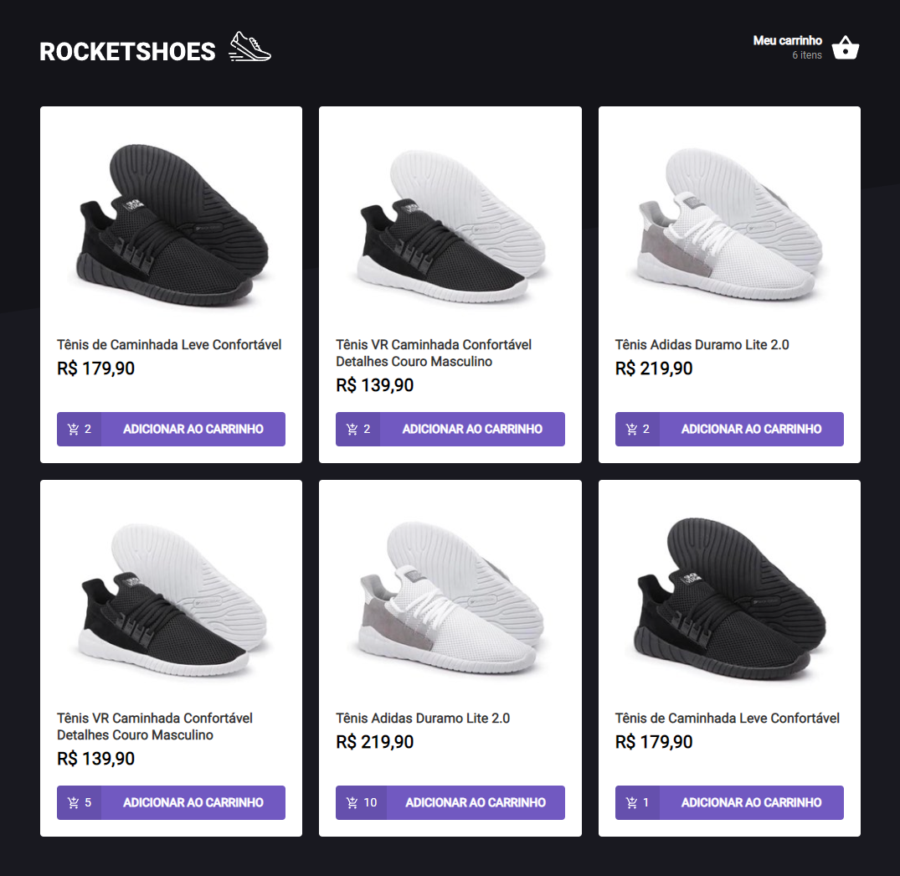
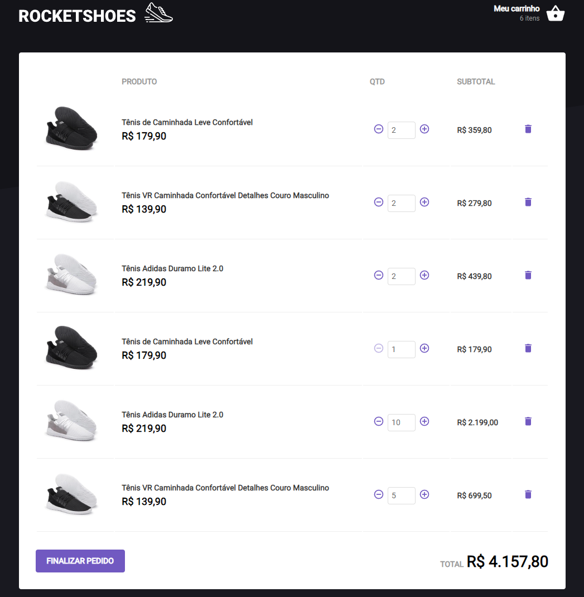

<h1 align="center">
   
  
    
  

    
    
    
  

</h1>

## ✨ Description

This app is a sneakers store shopping cart developed during the "Ignite - ReactJS" bootcamp by [@Rocketseat](https://www.rocketseat.com.br).

## 🚀 Technologies
-  React
    -  States, hooks, props, contexts
    -  Custom hooks
-  TypeScript
-  Styled-Components
-  Fetch data from API (JSON Server + Axios)
-  Map, filter and reduce to handle data
-  Handling errors

## 💻 Installation

After cloning/downloading this repository, open your terminal, navigate to the project's folder and run:

-  `npm install` - To install packages dependencies
-  `npm run server` - To run the fake API setup with JSON Server
-  while server is running open a new terminal and run `npm run start` to start the application.

## 🌟 Preview

